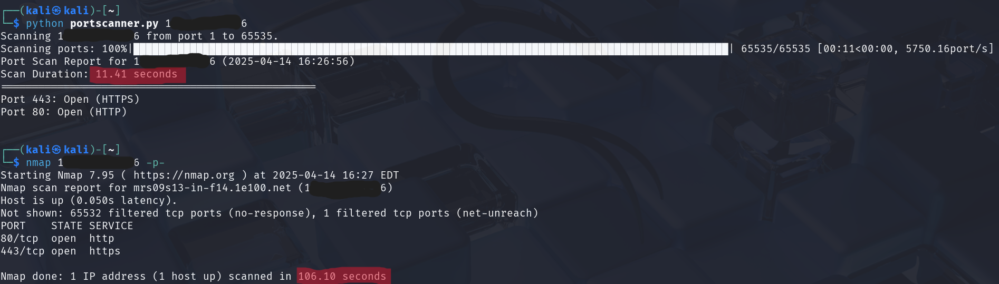

# Fast Port Scanner

A multi-threaded port scanner built in Python for ethical hacking and pentesting practice. Scans a target IP for open ports, identifies common services, and generates a report.

## Features
- Scans single ports or ranges (1-65535)
- Uses maximum available system threads for fastest scanning
- Detects common services (HTTP, SSH, FTP, etc.)
- Shows real-time progress bar
- Generates clean scan reports
- Validates IP addresses before scanning
- Works on Linux only

## Usage
Run the scanner with:
```
python port_scanner.py <target_ip> [-p PORT_RANGE]

```

## Examples
```
# Scan single port
python port_scanner.py 192.168.1.1 -p 80


# Scan port range
python port_scanner.py 10.0.0.5 -p 1-1000

# Scan all ports
python port_scanner.py 127.0.0.1 -p -
```

## Proof Of Concept

